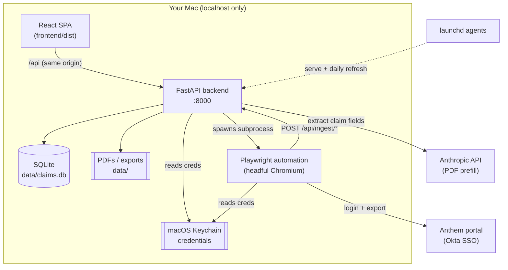
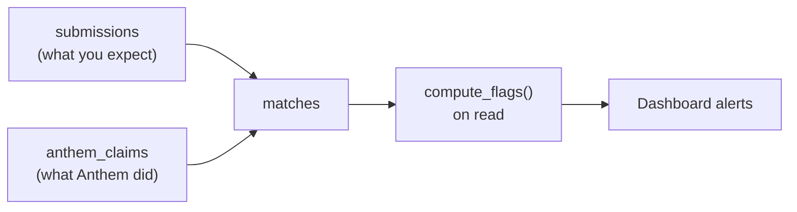

# Architecture

A high-level map of how Claims Tracker is put together. For setup and operation, see the
[README](README.md). For exhaustive module-by-module detail, see [CLAUDE.md](CLAUDE.md).

## What it is

Claims Tracker is a **single-machine, local-only** web app. It records the out-of-network
(OON) medical claims you've submitted to Anthem along with what you _expect_ to be
reimbursed, pulls Anthem's actual processing state once a day, and raises alerts when the
two diverge. Nothing is deployed to the cloud; your Anthem credentials live in the macOS
Keychain and never leave the machine.

It has three moving parts — a **React frontend**, a **FastAPI backend** over SQLite, and a
**Playwright automation** layer that logs into Anthem — all running on `localhost` and
supervised by macOS `launchd`.

## Core data flow

The heart of the app is the loop that links _what you submitted_ to _what Anthem did_:

1. **Submit** — You enter an OON claim in the frontend (optionally auto-filled from a PDF
   via the Anthropic API). It's stored in the `submissions` table with your expected
   reimbursement.
2. **Ingest** — Once a day (or on demand), the Playwright automation logs into Anthem,
   exports the claims CSV, and POSTs it to `/api/ingest/claims-csv`. The parser upserts
   rows into `anthem_claims`. Ingest is **upsert-only** — it never deletes.
3. **Match** — After every ingest (and every submission create/update), `run_matching()`
   links submissions to anthem_claims via the `matches` table, using a three-tier
   strategy: exact/alias provider match → auto; member+date only → suggestion; ambiguous →
   suggestion.
4. **Alert** — Alert flags are computed **on read**, never stored, by comparing a
   submission against its matched claim (missing, stale, denied, underpaid, vanished,
   etc.). The dashboard groups these per submission.

## Components

### Frontend (`frontend/src/`)

React 19 + TypeScript + Vite, styled with Tailwind. TanStack Query owns all server state;
`api.ts` is the single typed client (every call goes through a `req<T>()` helper that
throws on non-2xx). Pages map to the workflow: Dashboard, Submissions, Matches,
AnthemClaims, Totals, Refresh, Settings, plus detail pages. A global `YearContext` holds
the selected plan year and is threaded into every query.

In development, Vite proxies `/api` to the backend. In the deployed build, FastAPI serves
the built SPA itself, so there is **one origin** and no proxy.

### Backend (`backend/app/`)

FastAPI with all routes mounted under `/api` (`routes/` splits them by resource:
submissions, anthem_claims, matches, ingest, dashboard, totals, providers, automation,
settings). SQLAlchemy 2.x over SQLite; the schema auto-creates on startup. Key modules:

| Module            | Responsibility                                                       |
| ----------------- | -------------------------------------------------------------------- |
| `models.py`       | Five tables (see below)                                              |
| `ingest.py`       | Parse Anthem CSV/benefits, upsert, trigger matching                  |
| `matching.py`     | `run_matching()` three-tier submission↔claim linking                 |
| `alerts.py`       | `compute_flags()` — on-read alert computation against thresholds     |
| `automation.py`   | Spawn the Playwright subprocess, track status, inject Keychain creds |
| `extraction.py`   | Send an uploaded claim PDF to Claude to prefill form fields          |
| `storage.py`      | `Storage` ABC + `LocalFileStorage` for PDFs (swappable for S3)       |
| `credentials.py`  | Read/write Keychain items via `keyring`                              |
| `config.py`       | Alert thresholds and plan-year date helpers                          |
| `static_serve.py` | Serve the built SPA in production                                    |

### Automation (`automation/`)

Standalone Playwright scripts that share the backend venv. `auth.py` handles Anthem's Okta
SSO (identifier → password → MFA) and persists session cookies so MFA is needed only
occasionally. `fetch_claims.py` and `fetch_benefits.py` scrape and POST data back to the
API; `fetch_all.py` runs both under a single login and is what the backend spawns.

### Deployment (`deploy/`)

Two `launchd` LaunchAgents: `com.claimstracker.server` keeps `uvicorn` alive on
`127.0.0.1:8000`, and `com.claimstracker.refresh` fires the daily Anthem refresh (with
launchd catch-up after sleep). `install.sh` builds the frontend and renders/loads the
agent templates; the easy installer (`bootstrap.sh`) wraps this for non-developers.

## Data model

Five SQLite tables:

- **`submissions`** — claims _you_ filed, with expected reimbursement and an optional
  `submitted_date` (filing status).
- **`anthem_claims`** — rows scraped from Anthem's export (upsert-only; `last_seen_at`
  tracks presence across exports).
- **`matches`** — the link between the two, with a match type (auto / suggestion /
  confirmed).
- **`provider_aliases`** — learned name mappings; confirming a suggestion teaches a new
  alias for future auto-matching.
- **`benefits_snapshots`** — per-network accumulator readings captured at each ingest.

## Design decisions worth knowing

- **Money is always integer cents**, never floats. Parsing happens at ingest
  (`"$1,190.00"` → `119000`).
- **Alerts are computed on read, not stored.** State lives in the data; flags are derived,
  so they're never stale.
- **Ingest never deletes.** A claim that disappears from Anthem's latest export is
  surfaced via the `VANISHED` flag (its `last_seen_at` predates the newest ingest) rather
  than being silently dropped.
- **Credentials never touch the web layer.** Both Anthem and Anthropic credentials live in
  the macOS Keychain; the backend injects Anthem creds into the automation subprocess as
  env vars and never logs or persists them.
- **One origin in production.** FastAPI serves both the API and the SPA, so there's no
  CORS or proxy surface once deployed.
- **Plan-year filtering is pervasive.** Every data endpoint accepts `?year=YYYY` and
  filters by service date; the frontend drives it from a single global selector.
- **Local HTTP is acceptable** because everything is bound to `localhost`. The only
  plaintext surface is CSV upload, which carries no credentials.
